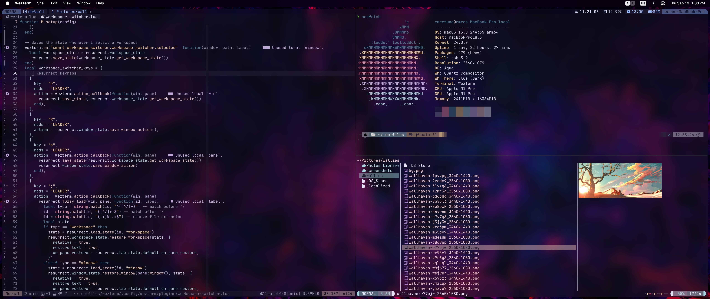

# Important

Directly use of this repo may conflict with your OS.
Repo maintained for personal purposes only, you may get inspiration using these configurations it tested
on linux mint and osx (which is currently supported by the repo).

## Screenshot

### Notes

This repo contains custom neowim configuration includes:

- [x] PHP
- [x] Javascript (React)
- [x] Typescript
- [x] Lua (Configuration for neovim)

Main focus of this repo is to have a keyboard-driven development environment, improving productivity with
tui apps keeping focus on code.

- `install.sh` provides complete set up on ubuntu based os.
- `install_minimal.sh` provides set up for osx.
- `laptop_extras.sh` some fancy apps to use on ubuntu based os.
