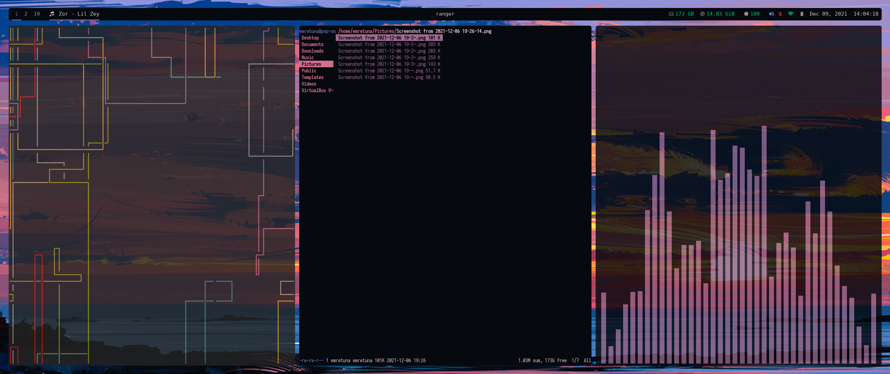
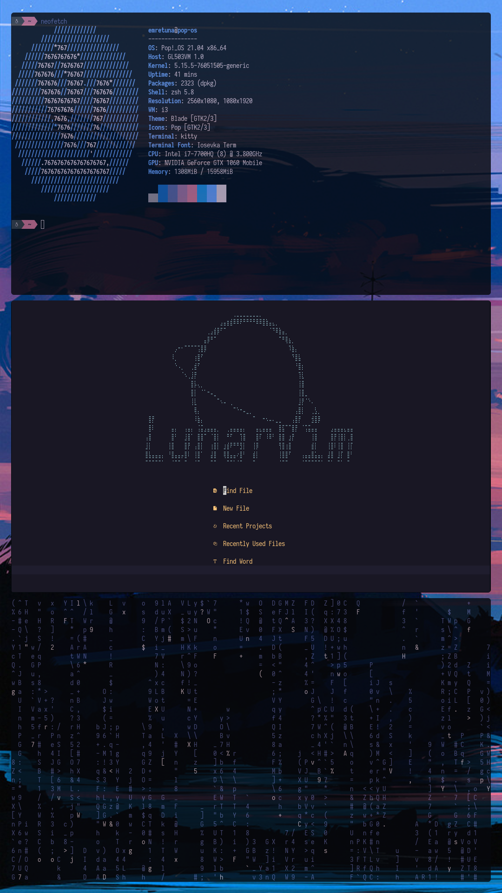

# .dotfiles
  ```
  sh -c "$(curl -fsSL https://raw.githubusercontent.com/emretuna/.dotfiles/main/install.sh)"
  ```
## Required
# i3-gaps
https://github.com/Airblader/i3/wiki/installation

# pywal
https://github.com/dylanaraps/pywal/wiki/Installation

# Picom
https://github.com/ibhagwan/picom

# Picom Installation
https://github.com/yshui/picom

# Extras for manual install if script fails
  ```
  sudo apt install rofi polybar imagemagick ffmpeg nitrogen alacritty arandr playerctl lxappearance blueman flameshot libnotify-bin pavucontrol
  ```
